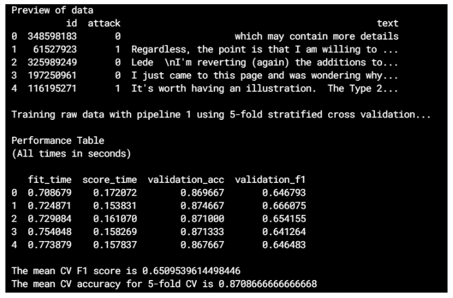

# Brief Overview of the Project
## Description of this repository

This code repository contains all the code that was written in the course of this competition. The code is written in python. Jupyter notebooks and .py scripts were used.

## Structure of the code

- data (large data files not committed)
    - external (external datasets used)
- models
    - descriptions.md (descriptions of models)
    - my474_models.xlsx (comprehensive coverage of ML model performances)
    - hyp_opt_ml.csv (hyperparameter optimization results for best ML algorithm)
    - hyp_opt_transformer.csv (hyperparameter optimization results for transformer model)
- notebooks
    - check_data.ipynb (check data validity)
    - exploration.ipynb (data exploration and EDA)
    - language_translation.ipynb (experimentation with preprocessing)
    - misclassification_analysis.ipynb (analyzing where the models fail)
    - make_test_numeric.ipynb (process the test data to get numeric features)
- src
    - code_best_models.ipynb (combine the code for the best models to include in the report)
    - config.py (global values used across other scripts)
    - preprocess.py (preprocessing operations)
    - heuristical.py (functions to make heuristical classifications)
    - feature_selection.py (feature selection techniques) 
    - pipelines.py (end-to-end machine learning pipelines)
    - train.py (initial training script; not used in the final models)
    - train2.py (final training script)
    - inference.py (initial inference script; not used in the final models)
    - inference2.py (final inference script)
    - textprocessing.py (experimentation with textprocessing techniques)
    - deeplearning_ulmfit.py (ULM-FiT approach)
    - deeplearning_transformer.py (RoBERTa)
    - run_models_cv.sh (bash script to run ML models with 5-fold cross validation)
    - ml_best_hyp_opt.py (hyperparameter optimization for the best ML model)
    - transformer_hyp_opt.py (hyperparameter optimization for the transformer model)
- startup.sh (bash script to install dependencies)
- README.md

## Reproducing the results

The ML models built in the course of solving this text classification problem can be easily reproduced with almost none to minimal tweaking of code. The steps are as follows:

1. Run the *startup.sh* bash script to download necessary packages
2. Run *run_models_cv.sh* bash script in the `src` directory to obtain CV scores for 5 ML models(the other models can be obtained by tweaking some of the parameters in the code). This file runs the `train2.py` python script by passing in different parameters to generate each of the 5 models
3. Run *inference2.py* python script in the `src` directory by passing in the correct arguments to generate the submission file for the test dataset

An example of the output of one model's CV performance

The Deep learning models were run on Kaggle’s notebooks (or kernels) in order to make use of GPU support. GPU support and the use of Kaggle’s cloud resources were necessary as my physical system was unable to handle the heaviness associated with training complex deep learning architecture. The code used has been housed in python scripts in `src` with the pattern `deeplearning_{model_specifics}.py` . Inference is run in the same notebook itself.

### Running the python scripts

The python scripts *train2.py* and *inference2.py* can be run individually from the terminal/command line. The general format for running the scripts are ` python {name_of_file.py} --pipeline_number {1 or 2 or 3 or 4} --data {raw or with_numeric or with_numeric_translated`. Eg: `python train2.py --pipeline_number 4 --data with_numeric` or Eg: `python inference2.py --pipeline_number 4 --data with_numeric`

*src/pipelines.py* contains the code that provide information on what each pipeline and data combination contain.

**NOTE:** There is no necessity to run *train2.py* before running *inference2.py*. This is because running the inference script automatically trains the selected model pipeline on all 15000 observations in the training data and makes predictins with this trained model on the 100000 observations of the test set.